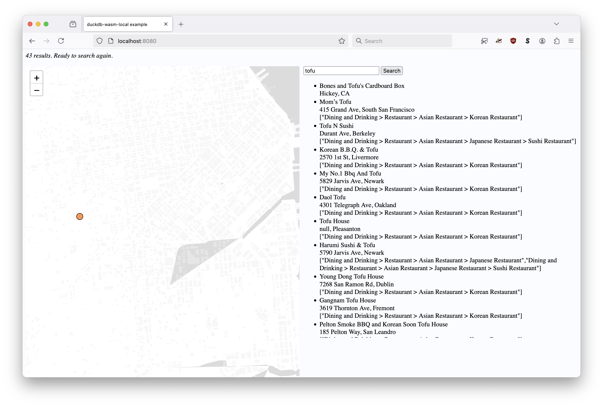

# whosonfirst-external-duckdb

## Notes

* All `.wasm` and `.parquet` files are tracked and stored using git lfs.

## www

### Setting up

#### PMTiles

First, derive the bounding box for San Francisco, Alameda and San Mateo counties using the `mbr` tool in the [whosonfirst/go-whosonfirst-spatial](https://github.com/whosonfirst/go-whosonfirst-spatial) package:

```
$> cd /usr/local/src/go-whosonfirst-spatial
$> ./bin/mbr -id 102087579 -id 102086959 -id 102085387
-123.173825,37.053858,-121.469214,37.929824
```

Next, extract the tile data for that bounding box from the global Protomaps tileset using the [protomaps/go-pmtiles](https://github.com/protomaps/go-pmtiles) package:

```
$> cd /usr/local/src/go-pmtiles
$> go run main.go extract https://build.protomaps.com/20250113.pmtiles sfba.pmtiles --bbox="-123.173825,37.053858,-121.469214,37.929824"
```

Note: As of this writing the above command produces some weird artifacting which I don't really understand yet:



Inspect the slice of tile data:

```
$> du -h sfba.pmtiles 
128M	sfba.pmtiles

$> go run main.go show sfba.pmtiles
pmtiles spec version: 3
tile type: Vector Protobuf (MVT)
bounds: (long: -123.173825, lat: 37.053858) (long: -121.469214, lat: 37.929824)
min zoom: 0
max zoom: 15
center: (long: -122.321519, lat: 37.491841)
center zoom: 0
addressed tiles count: 21419
tile entries count: 13773
tile contents count: 13204
clustered: true
internal compression: 2
tile compression: 2
attribution <a href="https://www.openstreetmap.org/copyright" target="_blank">&copy; OpenStreetMap</a>
planetiler:osm:osmosisreplicationtime 2025-01-13T04:00:00Z
planetiler:buildtime 2024-08-08T09:48:19.662Z
planetiler:osm:osmosisreplicationseq 108141
planetiler:version 0.8-SNAPSHOT
vector_layers <object...>
name Protomaps Basemap
description Basemap layers derived from OpenStreetMap and Natural Earth
planetiler:githash 1ccd7eea115e2ff63d2e898f2f84cca461c0074a
planetiler:osm:osmosisreplicationurl https://planet.osm.org/replication/hour/
type baselayer
version 4.0.4
pgf:devanagari:name NotoSansDevanagari-Regular
pgf:devanagari:version 1
```

## See also

* https://github.com/whosonfirst/go-whosonfirst-external
* https://github.com/whosonfirst-data?q=whosonfirst-external-&type=all&language=&sort=