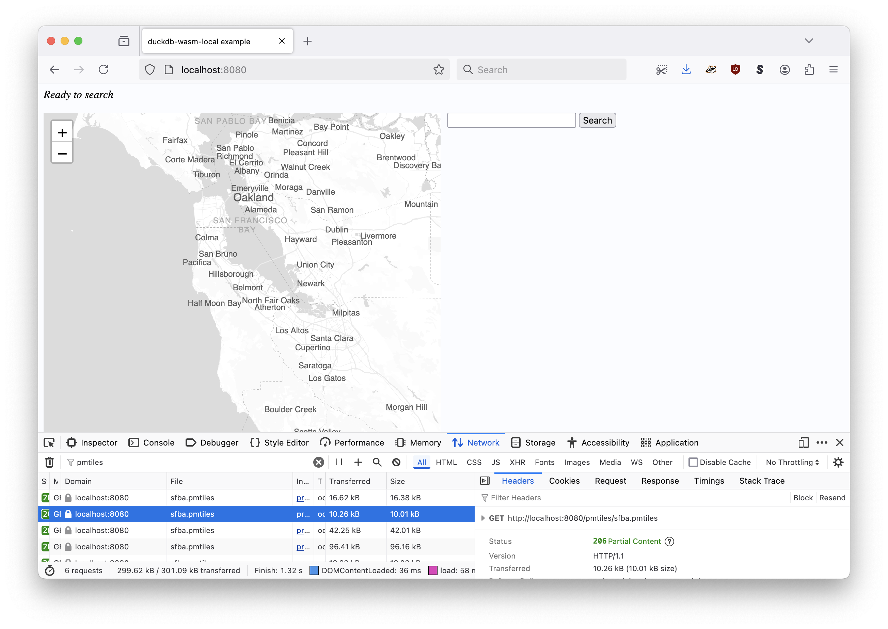
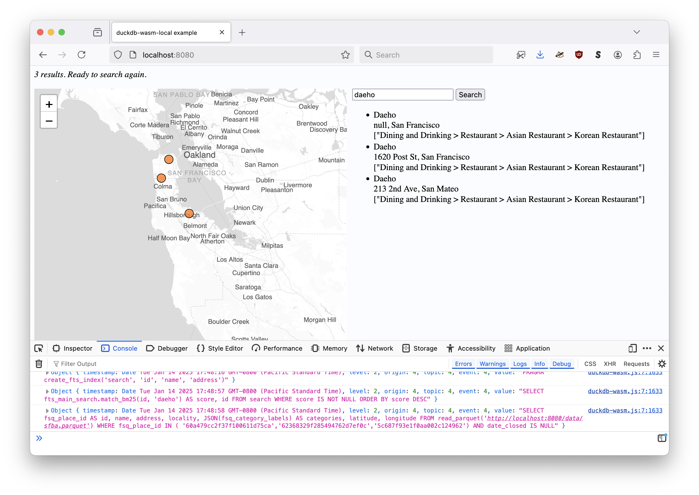

# whosonfirst-external-duckdb/www

## This is work in progress

Documentation is incomplete.

## Setting up

Note: The `sfba.parquet` and `sfba.pmtiles` that are created in the examples below are actually bundled with this respository. The documentation is provided so you can how you might create your own data sources to work with.

### Parquet data

_To be written_

### PMTiles

First, derive the bounding box for San Francisco, Alameda and San Mateo counties using the `mbr` tool in the [whosonfirst/go-whosonfirst-spatial](https://github.com/whosonfirst/go-whosonfirst-spatial) package:

```
$> cd /usr/local/src/go-whosonfirst-spatial
$> ./bin/mbr -id 102087579 -id 102086959 -id 102085387
-123.173825,37.053858,-121.469214,37.929824
```

Next, extract the tile data for that bounding box from the global Protomaps tileset using the [protomaps/go-pmtiles](https://github.com/protomaps/go-pmtiles) package:

```
$> cd /usr/local/src/go-pmtiles
$> go run main.go extract https://build.protomaps.com/20240812.pmtiles sfba.pmtiles --bbox="-123.173825,37.053858,-121.469214,37.929824"
```

Note: Until the [protomaps-leaflet.js](https://github.com/protomaps/protomaps-leaflet) library has been updated to support Protomaps "v4" builds make sure you grab data from a "v3" Protomaps build, circa August 2024 or earlier.

```
$> du -h sfba.pmtiles 
128M	sfba.pmtiles

$> go run main.go show sfba.pmtiles
pmtiles spec version: 3
tile type: Vector Protobuf (MVT)
bounds: (long: -123.173825, lat: 37.053858) (long: -121.469214, lat: 37.929824)
min zoom: 0
max zoom: 15
center: (long: -122.321519, lat: 37.491841)
center zoom: 0
addressed tiles count: 21419
tile entries count: 13773
tile contents count: 13204
clustered: true
internal compression: 2
tile compression: 2
attribution <a href="https://www.openstreetmap.org/copyright" target="_blank">&copy; OpenStreetMap</a>
planetiler:osm:osmosisreplicationtime 2025-01-13T04:00:00Z
planetiler:buildtime 2024-08-08T09:48:19.662Z
planetiler:osm:osmosisreplicationseq 108141
planetiler:version 0.8-SNAPSHOT
vector_layers <object...>
name Protomaps Basemap
description Basemap layers derived from OpenStreetMap and Natural Earth
planetiler:githash 1ccd7eea115e2ff63d2e898f2f84cca461c0074a
planetiler:osm:osmosisreplicationurl https://planet.osm.org/replication/hour/
type baselayer
version 4.0.4
pgf:devanagari:name NotoSansDevanagari-Regular
pgf:devanagari:version 1
```

### Who's On First properties (names)

Create a properties lookup table (currently just for place names for localities and neighbourhoods) derived from the `sfba.parquet` table derived from Who's On First records hosted on `data.whosonfirst.org` using the `area-whosonfirst-properties` tool in the [whosonfirst/go-whosonfirst-external](https://github.com/whosonfirst/go-whosonfirst-external?tab=readme-ov-file#area-whosonfirst-properties) package. For example:

```
$> area-whosonfirst-properties/main.go \
	-area-parquet sfba.parquet \
	-whosonfirst-parquet whosonfirst.parquet
```	

And then:

```
$> duckdb
v1.1.3 19864453f7
Enter ".help" for usage hints.
Connected to a transient in-memory database.
Use ".open FILENAME" to reopen on a persistent database.

D LOAD spatial;
D SELECT id, name, ST_AsText(geometry) FROM read_parquet('whosonfirst.parquet') LIMIT 1;
┌──────────┬──────────────┬──────────────────────────────────────────────────────────────────────────────────────────────────────────────────────────────────────────────────────────────────────────┐
│    id    │     name     │                                                                           st_astext(geometry)                                                                            │
│  int32   │   varchar    │                                                                                 varchar                                                                                  │
├──────────┼──────────────┼──────────────────────────────────────────────────────────────────────────────────────────────────────────────────────────────────────────────────────────────────────────┤
│ 85866851 │ Union Square │ POLYGON ((-122.40238 37.790969, -122.40196 37.788922, -122.402066 37.788721, -122.408952 37.783288, -122.409142 37.783519, -122.410433 37.789951, -122.40238 37.790969)) │
└──────────┴──────────────┴──────────────────────────────────────────────────────────────────────────────────────────────────────────────────────────────────────────────────────────────────────────┘
```
## Serving the "www" folder

You will need to "serve" the `www` folder from a local webserver. These are lots of different ways to do that. I like to use the `fileserver` tool which is part of the [aaronland/go-http-fileserver](https://github.com/aaronland/go-http-fileserver) package:

```
$> cd /usr/local/src/go-http-fileserver
$> make cli

$> ./bin/fileserver -root /usr/local/src/whosonfirst-external-duckdb/www/
2025/01/14 17:41:37 Serving whosonfirst-external-duckdb/www/ and listening for requests on http://localhost:8080
```

Open your web browser to `http://localhost:8080` and you'll see something like this:





## See also

* https://github.com/whosonfirst/go-whosonfirst-external
* https://github.com/whosonfirst-data?q=whosonfirst-external-&type=all&language=&sort=
* https://github.com/protomaps/protomaps-leaflet
* https://maps.protomaps.com/builds/
